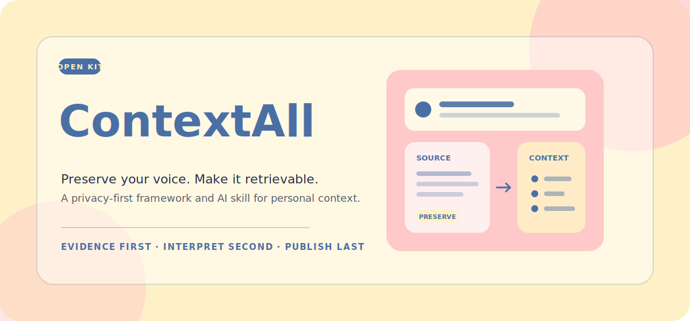
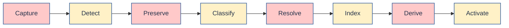

<p align="center">
  
</p>

<p align="center">
  <strong>A privacy-first framework and AI skill for preserving, indexing, and activating personal context.</strong>
</p>

<p align="center">
  <a href="#quick-start"></a>
  <a href="docs/ARCHITECTURE.md"></a>
  <a href="docs/PRIVACY.md"></a>
</p>

<p align="center">
  <sub>让 AI 理解你，但不替你重写自己。</sub>
</p>

---

## Why ContextAll exists

Most “second brain” systems eventually become one of two things: a warehouse nobody can search, or a pile of AI summaries that no longer sounds like the person who lived them.

ContextAll takes a different position:

> **Store evidence first. Interpret it second. Publish it last.**

Raw words, later interpretations, and public work are different artifacts with different trust levels. ContextAll keeps them separate—and keeps the links between them.

## The Context chain



| Stage | What happens | Trust rule |
|---|---|---|
| **Capture** | Accept text, transcripts, interviews, conversations, references, or design preferences | No premature cleanup |
| **Detect** | Choose the correct transformation policy for the input mode | Structure follows source type |
| **Preserve** | Create a canonical source-of-truth note | Original voice stays intact |
| **Classify** | Route by meaning rather than file format | One primary semantic home |
| **Resolve** | Append when entity + durable topic match; otherwise create | Uncertainty stays reversible |
| **Index** | Add entities, aliases, section paths, and keywords | Every pointer resolves to a passage |
| **Derive** | Generate questions, links, hypotheses, or summaries | Never disguised as original belief |
| **Activate** | Route mature material into content, products, projects, or decisions | Provenance travels downstream |

## The non-negotiable boundary

<table>
  <tr>
    <td width="50%" valign="top">
      <h3>🌸 Source Context</h3>
      <p>What the person actually said, experienced, noticed, doubted, or decided.</p>
      <p><strong>Canonical evidence.</strong> Structure-only edits.</p>
    </td>
    <td width="50%" valign="top">
      <h3>☀️ Derived Context</h3>
      <p>AI-generated questions, summaries, connections, counterpoints, and possible routes.</p>
      <p><strong>Useful interpretation.</strong> Always visibly labeled.</p>
    </td>
  </tr>
</table>

An AI summary can help locate a passage. It cannot replace that passage or become a quote.

## Retrieval without rereading everything

ContextAll uses a lightweight, inspectable retrieval graph built from Markdown and YAML:

```text
entity index → candidate note → topic_index → exact heading → source passage
```

The first screen works for a human. Structured metadata works for an agent. Both arrive at the same source.

## What is included

```text
ContextAll/
├── README.md
├── assets/                         # README visual assets
├── docs/
│   ├── ARCHITECTURE.md             # five-layer model and trust order
│   ├── WORKFLOW.md                 # end-to-end write and review path
│   ├── DESIGN.md                   # visual language and UI principles
│   ├── PRIVACY.md                  # public/private data boundary
│   └── GITHUB-CHECKLIST.md
├── examples/                       # fictional, public-safe fixtures
└── skills/
    └── contextall-manager/
        ├── SKILL.md                # agent runtime instructions
        ├── agents/openai.yaml
        ├── references/             # routing, schema, and review rules
        └── assets/                 # templates, config, and design tokens
```

## Quick start

### 1. Install the skill

Copy the skill directory into your Codex skills folder:

```bash
cp -R skills/contextall-manager ~/.codex/skills/
```

### 2. Create private configuration

Copy the public-safe examples into a private vault:

```bash
cp skills/contextall-manager/assets/config/profile.example.md /path/to/private-vault/profile.md
cp skills/contextall-manager/assets/config/vault-map.example.yaml /path/to/private-vault/vault-map.yaml
```

Replace the example paths, identity aliases, privacy rules, and destination folders. Do not commit these private files to this repository.

### 3. Use it

```text
Use $contextall-manager to organize this interview,
preserve my wording, and update the relevant indexes.
```

Other useful prompts:

- “Put these mixed notes into my Context vault and tell me what was created or appended.”
- “Find everything I have actually said about Project Atlas. Do not quote AI-derived summaries.”
- “Organize this conversation by speaker and topic without polishing our views.”
- “Add this visual preference to my design Context and update the design tokens.”

## Information architecture

ContextAll separates five layers:

| Layer | Role | AI may rewrite? |
|---|---|---|
| **Capture** | Temporary ingress | No |
| **Canonical Context** | Personal voice and lived evidence | Structure only |
| **Retrieval graph** | Entities, aliases, topics, and paths | Mechanically |
| **Derivation** | Questions, links, hypotheses, summaries | Yes, with provenance |
| **Destinations** | Content, products, projects, decisions | Yes, by destination rules |

Read the full [architecture](docs/ARCHITECTURE.md) and [workflow](docs/WORKFLOW.md).

## Privacy model

The framework is public. Identity stays private.

**Safe to publish:** schemas, templates, fictional examples, routing rules, and visual tokens.

**Keep private:** real profiles, conversations, transcripts, entity indexes, source paths, health or relationship data, and confidential work material.

See the complete [privacy model](docs/PRIVACY.md) before connecting a real vault.

## Design language

The visual system follows a warm 50 / 30 / 20 balance:

<p>
  
  
  
</p>

- `#FFC9C9` carries warmth and primary surfaces.
- `#FFF1C7` creates breathing room and gentle secondary regions.
- `#4A6FA5` is reserved for titles, links, controls, borders, and focus.

Executable CSS tokens live in [`design-tokens.css`](skills/contextall-manager/assets/design/design-tokens.css).

## Project status

This first release ships the information architecture, agent workflow, schemas, templates, privacy boundary, fictional examples, and visual language. A database or web UI can be added later without changing the source-of-truth model.

---

<p align="center">
  <strong>Keep the source. Make the connection. Choose what it becomes.</strong>
</p>
