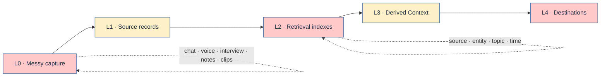

<p align="right"><a href="README.zh-CN.md">简体中文</a> · <strong>English</strong></p>

<p align="center">
  
</p>

<p align="center">
  <strong>Turn scattered human traces into trustworthy, addressable personal Context.</strong>
</p>

<p align="center">
  <a href="#quick-start"></a>
  <a href="docs/INDEXING.md"></a>
  <a href="docs/PRIVACY.md"></a>
</p>

---

## Context does not arrive as a clean document

Personal Context appears everywhere:

- a sentence in a chat;
- three disconnected thoughts in a voice transcript;
- an interview answer that explains an old decision;
- a journal paragraph, meeting note, clipping, OCR result, or product draft;
- the same idea expressed differently across several months;
- one conversation where speakers, topics, and chronology are tangled together.

It is often repetitive, unfinished, out of order, and “one sentence here, another sentence there.” That mess is not noise to erase. It is evidence with missing structure.

ContextAll adds the structure without silently rewriting the person.

> **Preserve first. Index second. Interpret third. Activate last.**

## What ContextAll does



| Layer | Holds | Rule |
|---|---|---|
| **L0 · Capture** | raw fragments from many sources | do not force coherence too early |
| **L1 · Source records** | organized original words and attributable external material | structural cleanup only |
| **L2 · Indexes** | source, entity, topic, time, aliases, and exact section paths | every pointer must resolve |
| **L3 · Derived Context** | AI summaries, questions, links, and hypotheses | visibly separate from source |
| **L4 · Destinations** | content, products, projects, decisions, and reflection | preserve provenance downstream |

The system never treats an AI summary as something the user actually said.

## Index before you search

ContextAll does not ask an agent to reread an entire vault. It narrows the search in stages:

```text
query
  → source / entity / topic / time index
  → candidate note
  → note-level topic_index
  → exact heading
  → attributable source passage
```

Four index views answer different questions:

| Index | Answers |
|---|---|
| **Source index** | Where did this come from? Which fragments belong to the same capture? |
| **Entity index** | What have I said about this person, company, product, or project? |
| **Topic index** | Which notes contain this concrete issue, judgment, tension, or plan? |
| **Timeline** | What changed, and in what order? |

Read the complete [indexing contract](docs/INDEXING.md).

## Source and interpretation are different things

<table>
  <tr>
    <td width="50%" valign="top">
      <h3>Source Context</h3>
      <p>Original words, events, examples, uncertainty, attribution, and source location.</p>
      <p><strong>Use this for evidence and quotation.</strong></p>
    </td>
    <td width="50%" valign="top">
      <h3>Derived Context</h3>
      <p>AI-generated summaries, questions, cross-note links, hypotheses, and possible routes.</p>
      <p><strong>Use this to think—not to fake provenance.</strong></p>
    </td>
  </tr>
</table>

## Quick start

### 1. Install the skill

```bash
cp -R skills/contextall-manager ~/.codex/skills/
```

### 2. Configure a private vault

```bash
cp skills/contextall-manager/assets/config/profile.example.md /path/to/private-vault/profile.md
cp skills/contextall-manager/assets/config/vault-map.example.yaml /path/to/private-vault/vault-map.yaml
cp skills/contextall-manager/assets/config/design-profile.example.md /path/to/private-vault/design-profile.md
```

Replace the example paths, identity aliases, privacy boundaries, semantic domains, and index locations. Keep real profiles and source material outside this public repository.

### 3. Organize a messy input

```text
Use $contextall-manager to organize these scattered notes.
Preserve my words, keep source fragments traceable,
and update the source, entity, and topic indexes.
```

## Your Context, your design

ContextAll does not prescribe a personal aesthetic. The colors in this repository belong to the repository identity—not to every user's vault.

Before generating a UI, dashboard, card, or visual artifact, the skill asks the user to define or approve:

1. primary, supporting, and emphasis colors;
2. preferred visual mood;
3. typography and density preferences;
4. accessibility constraints;
5. where each color may and may not appear.

Use the guided [`design-profile.example.md`](skills/contextall-manager/assets/config/design-profile.example.md). The agent must not invent a permanent palette when the profile is missing.

## Repository map

```text
ContextAll/
├── README.md / README.zh-CN.md     # bilingual entry points
├── docs/
│   ├── README.md                   # documentation index
│   ├── ARCHITECTURE.md             # layer and trust model
│   ├── INDEXING.md                 # source/entity/topic/time indexes
│   ├── WORKFLOW.md                 # write, retrieve, and review paths
│   ├── DESIGN.md                   # user-owned design profile
│   └── PRIVACY.md
├── examples/                       # fictional public-safe fixtures
└── skills/contextall-manager/
    ├── SKILL.md
    ├── references/                 # runtime rules and schemas
    └── assets/                     # configs and note/index templates
```

Start with the [documentation index](docs/README.md), then read the [architecture](docs/ARCHITECTURE.md) and [workflow](docs/WORKFLOW.md).

## Project status

ContextAll currently ships the layer model, indexing contract, agent workflow, schemas, templates, privacy boundary, design-profile prompt, and fictional examples. A web UI or database can be added later without changing the source-of-truth contract.

---

<p align="center"><strong>Keep the source. Build the index. Choose what it becomes.</strong></p>
