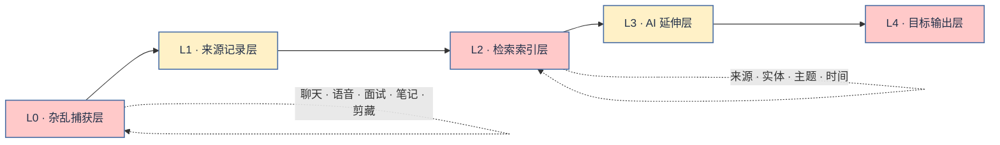

<p align="right"><strong>简体中文</strong> · <a href="README.md">English</a></p>

<p align="center">
  
</p>

<p align="center">
  <strong>把散落、跳跃、东一句西一句的人生材料，整理成可信、可定位、可调用的个人 Context。</strong>
</p>

---

## Context 从来不是一篇整洁的文档

一个人的 Context 可能来自很多地方：

- 聊天里随口说的一句话；
- 语音转写中三个互不相邻的念头；
- 面试回答里突然讲清楚的一次旧选择；
- 日记、会议记录、网页剪藏、OCR、产品草稿；
- 同一个观点在几个月里不断变化的多个版本；
- 一场人物、主题、时间顺序全都交织在一起的对话。

这些材料通常是重复的、没说完的、顺序混乱的。它们东一句、西一句，甚至彼此矛盾。

ContextAll 不把这种混乱当成应该删除的噪音。它把混乱视为：**还没有结构的证据。**

> **先保留，再索引；先分清来源，再进行解释；最后才决定它要变成什么。**

## ContextAll 的五层设计



| 层级 | 保存什么 | 核心纪律 |
|---|---|---|
| **L0 · 捕获层** | 各种来源的原始碎片 | 不要过早强行总结 |
| **L1 · 来源记录层** | 整理后的本人原话与可追溯外部材料 | 只做结构整理，不做观点润色 |
| **L2 · 检索索引层** | 来源、人物、项目、主题、时间、别名与章节路径 | 每个索引必须能落到原文段落 |
| **L3 · AI 延伸层** | 总结、问题、联系、假设、可能方向 | 必须与原话明确隔离 |
| **L4 · 输出层** | 内容、产品、项目、决策与关系反思 | 输出仍然保留来源链 |

AI 的总结可以帮助你找到原文，但不能冒充你真正说过的话。

## 不是“全文搜索”，而是逐层缩小

ContextAll 不要求 AI 每次重新通读整个资料库，而是按照以下路径定位：

```text
问题
  → 来源 / 实体 / 主题 / 时间索引
  → 候选文档
  → 文档顶部 topic_index
  → 精确章节
  → 可追溯的原文段落
```

四种索引分别回答不同问题：

| 索引 | 回答的问题 |
|---|---|
| **来源索引** | 这段话来自哪里？哪些碎片属于同一次捕获？ |
| **实体索引** | 我对这个人、公司、产品或项目说过什么？ |
| **主题索引** | 哪些文档涉及这个具体问题、判断、冲突或计划？ |
| **时间索引** | 我的判断在什么时候发生了变化？ |

完整协议见 [索引设计](docs/INDEXING.md)。

## 原话与 AI 延伸必须分开

<table>
  <tr>
    <td width="50%" valign="top">
      <h3>来源 Context</h3>
      <p>原话、事件、例子、不确定性、发言人和来源位置。</p>
      <p><strong>引用和事实判断优先读取这里。</strong></p>
    </td>
    <td width="50%" valign="top">
      <h3>延伸 Context</h3>
      <p>AI 生成的总结、问题、跨文档联系、反向判断与可能去向。</p>
      <p><strong>它帮助思考，但不能伪装成原话。</strong></p>
    </td>
  </tr>
</table>

## 快速开始

### 1. 安装 Skill

```bash
cp -R skills/contextall-manager ~/.codex/skills/
```

### 2. 配置你的私有资料库

```bash
cp skills/contextall-manager/assets/config/profile.example.md /你的私有路径/profile.md
cp skills/contextall-manager/assets/config/vault-map.example.yaml /你的私有路径/vault-map.yaml
cp skills/contextall-manager/assets/config/design-profile.example.md /你的私有路径/design-profile.md
```

把示例路径、身份别名、隐私边界、分类目录和索引位置替换成自己的配置。真实人物档案和原始资料不要提交到这个公开仓库。

### 3. 整理一批杂乱材料

```text
使用 $contextall-manager 整理下面这些东一句西一句的材料。
保留我的原话，让每个片段能追溯来源，
并更新来源索引、实体索引和主题索引。
```

## 你的 Context，也应该是你的设计

ContextAll 不规定用户必须使用哪套颜色。仓库当前的视觉只属于 ContextAll 项目本身，不等于你的个人资料库也要长成这样。

在生成界面、仪表盘、卡片或其他视觉内容前，Skill 会引导用户提供或确认：

1. 主色、辅助色与强调色；
2. 希望呈现的视觉气质；
3. 字体、圆角、留白和信息密度偏好；
4. 无障碍和对比度要求；
5. 每种颜色适合出现和禁止出现的位置。

可以从 [`design-profile.example.md`](skills/contextall-manager/assets/config/design-profile.example.md) 开始。没有用户确认时，Agent 不应擅自把示例配色变成长期设计规范。

## 项目结构

```text
ContextAll/
├── README.md / README.zh-CN.md     # 中英文入口
├── docs/
│   ├── README.md                   # 文档总索引
│   ├── ARCHITECTURE.md             # 分层与信任模型
│   ├── INDEXING.md                 # 来源/实体/主题/时间索引
│   ├── WORKFLOW.md                 # 写入、检索与复查链路
│   ├── DESIGN.md                   # 用户自定义设计档案
│   └── PRIVACY.md
├── examples/                       # 虚构、可公开测试材料
└── skills/contextall-manager/
    ├── SKILL.md
    ├── references/                 # 运行规则和协议
    └── assets/                     # 配置与文档/索引模板
```

先查看 [文档总索引](docs/README.md)，再进入 [系统架构](docs/ARCHITECTURE.md) 与 [处理链路](docs/WORKFLOW.md)。

## 当前状态

ContextAll 当前已经包含分层模型、索引协议、Agent 工作流、文档模板、隐私边界、设计档案引导和虚构示例。以后即使增加网页界面或数据库，也不需要改变“原话优先、索引可定位、AI 延伸隔离”的底层协议。

---

<p align="center"><strong>保留原话，建立索引，再决定它要变成什么。</strong></p>
